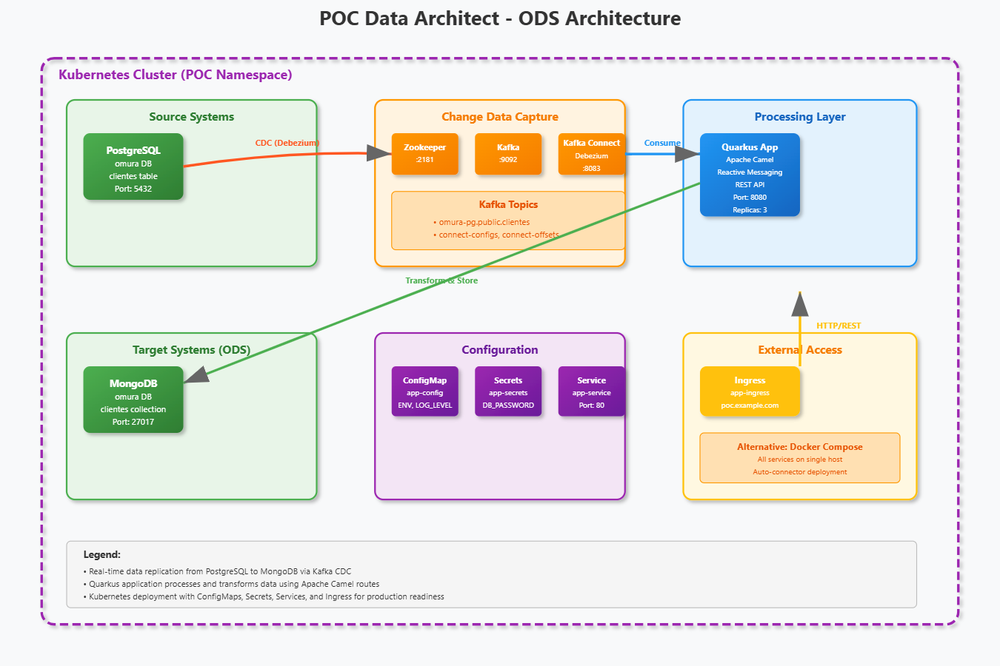
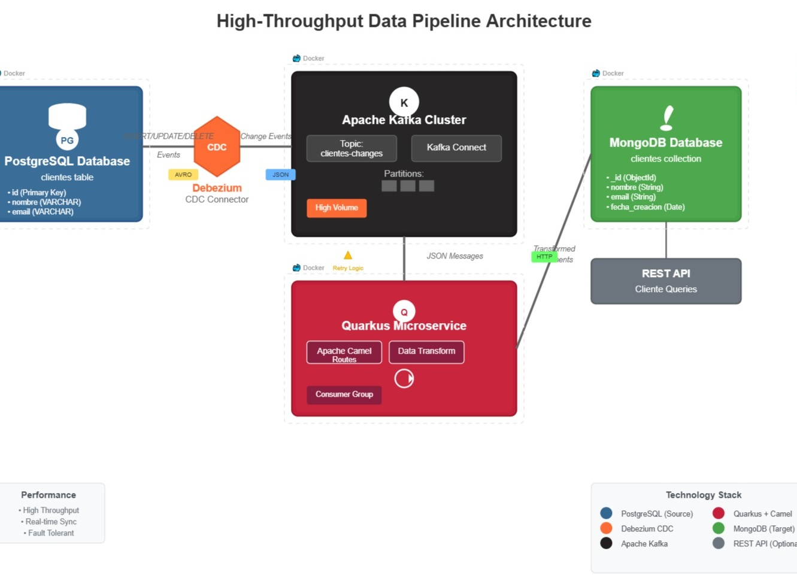

**README.md**

# POC OMURA Data Architect

This repository contains all artifacts needed to spin up a Proof-of-Concept (POC) for the OMURA Data Architect solution, including Docker, scripts, and Quarkus / Kubernetes manifests.

---

## Repository Layout

```
poc-data-architect-realtime-on-quarkus/
├── README.md                        # POC overview and instructions
├── LICENSE                          # MIT license
├── dir.txt                          # Auto-generated directory listing
│
├── docker/                          # Docker assets for Quarkus + services
│   ├── Dockerfile                   # Builds the Quarkus native image
│   └── docker-compose.yml           # Local multi-container setup (Kafka, ZK, Quarkus)
│
├── k8s/                             # Kubernetes manifests for dev & prod
│   ├── namespace.yaml               # poc namespace definition
│   ├── configmap.yaml               # Environment variables (e.g. POSTGRES_URL)
│   ├── secret.yaml                  # Base64-encoded secrets
│   ├── deployment.yaml              # Catch-all app deployment (ZK, Kafka Connect, etc.)
│   ├── service.yaml                 # ClusterIP / LoadBalancer services
│   ├── ingress.yaml                 # Ingress rules (host/path)
│   ├── debezium-connector-postgres.json  # Debezium Postgres source config
│   └── mongo-sink-connector.json    # MongoDB sink connector config
│
├── postgres/                        # Postgres setup & init scripts
│   ├── init/                        # Database initialization scripts
│   │   ├── schema.sql               # DDL (tables, indexes)
│   │   └── seed-data.sql            # Sample data load
│   └── Dockerfile                   # (Optional) Custom Postgres image with init
│
├── quarkus-app/                     # The Quarkus microservice
│   ├── pom.xml                      # Maven build descriptor
│   ├── src/
│   │   ├── main/
│   │   │   ├── java/                # Application code (packages under com.omura…)
│   │   │   └── resources/           # application.properties, log configs
│   │   └── test/                    # Unit & integration tests
│   └── target/                      # Compiled classes & native runner (git-ignored)
│
├── scripts/                         # Helper scripts for setup & deploy
│   ├── install-k8s.sh               # macOS/Linux Minikube install
│   ├── install-k8s.ps1              # Windows PowerShell Minikube install
│   └── build-and-run.sh             # Builds images, applies k8s, port-forwards
│
└── .github/                         # CI/CD workflows (if still present)
    └── workflows/
        └── ci-cd-pipeline.yml      # GitHub Actions pipeline

```


---


## ODS Architecture Overview


### What it is in a nutshell

An ODS is a database designed to integrate data from multiple operational systems to support operational reporting and decision-making. It sits between your transactional systems (like CRM, ERP, etc.) and your data warehouse.

#### Key characteristics
- Real-time or near real-time data: Unlike traditional data warehouses that are updated in batches, an ODS provides current operational data.
- Integrated view: Combines data from various source systems into a unified, consistent format.
- Operational focus: Designed for day-to-day business operations rather than historical analysis.
- Detailed data: Maintains transaction-level detail rather than summarized data.

#### Common use cases

- Real-time dashboards for operations teams
- Customer service representatives needing a 360-degree customer view
- Regulatory reporting that requires current data
- Operational analytics and monitoring


## Data Pipeline Design Overview


### Architecture Pattern: Real-time Change Data Capture (CDC)

_CDC-to-ODS pipelines in a nutshell! :_

**Data Flow**: PostgreSQL → Kafka (via Debezium) → Quarkus/Camel → MongoDB

## **Key Components Analysis**

**Source Layer (PostgreSQL)**
- Traditional OLTP database with a `clientes` table
- CDC-enabled to capture real-time changes without impacting operational performance

**Streaming Layer (Kafka + Debezium)**
- **Debezium**: Acts as the CDC connector, converting database changes into Kafka events
- **Kafka**: Event streaming backbone with topic-based data distribution
- Provides durability, scalability, and decoupling between source and target systems

**Processing Layer (Quarkus/Camel)**
- **Quarkus**: Cloud-native Java framework for microservices
- **Apache Camel**: Integration framework for data transformation and routing
- Handles real-time stream processing and data transformation logic

**Target Layer (MongoDB)**
- Document-based NoSQL database serving as the ODS
- Optimized for operational queries and flexible schema evolution

## **Architecture Benefits**
- **Real-time data availability**: Near-zero latency for operational insights
- **Loose coupling**: Systems can evolve independently
- **Scalability**: Event-driven architecture scales horizontally
- **Fault tolerance**: Kafka provides message durability and replay capabilities

## **Use Case Fit**
This is a modern, cloud-native approach to building an ODS that prioritizes real-time operational analytics over traditional batch ETL processes. Perfect for customer 360 views, real-time dashboards, and operational decision-making.

---

## 🛠️ Local Setup Steps
Our CDC-to-ODS pipeline:

## **Architecture Pattern: Real-time Change Data Capture (CDC)**

**Data Flow**: PostgreSQL → Kafka (via Debezium) → Quarkus/Camel → MongoDB

## **Key Components Analysis**

**Source Layer (PostgreSQL)**
- Traditional OLTP database with a `clientes` table
- CDC-enabled to capture real-time changes without impacting operational performance

**Streaming Layer (Kafka + Debezium)**
- **Debezium**: Acts as the CDC connector, converting database changes into Kafka events
- **Kafka**: Event streaming backbone with topic-based data distribution
- Provides durability, scalability, and decoupling between source and target systems

**Processing Layer (Quarkus/Camel)**
- **Quarkus**: Cloud-native Java framework for microservices
- **Apache Camel**: Integration framework for data transformation and routing
- Handles real-time stream processing and data transformation logic

**Target Layer (MongoDB)**
- Document-based NoSQL database serving as the ODS
- Optimized for operational queries and flexible schema evolution

## **Architecture Benefits**
- **Real-time data availability**: Near-zero latency for operational insights
- **Loose coupling**: Systems can evolve independently
- **Scalability**: Event-driven architecture scales horizontally
- **Fault tolerance**: Kafka provides message durability and replay capabilities

## **Use Case Fit**
This is a modern, cloud-native approach to building an ODS that prioritizes real-time operational analytics over traditional batch ETL processes. Perfect for customer 360 views, real-time dashboards, and operational decision-making.
1. **Clone the repo**

   ```bash
   git clone https://github.com/yourorg/poc-omura-data-architect.git
   cd poc-omura-data-architect
   ```

2. **Install Kubernetes locally**

   * **Windows** (PowerShell as Admin):

     ```powershell
     ./scripts/install-k8s.ps1
     ```
   * **macOS / Linux**:

     ```bash
     bash scripts/install-k8s.sh
     ```

3. **Build & Run**

   ```bash
   bash scripts/build-and-run.sh
   ```

   * Builds Docker images (`docker/`) via Compose
   * Starts containers for local validation
   * Applies all `k8s/` manifests
   * Streams logs and port-forwards key services

4. **Access the POC**

   * Service UI: `http://localhost:8080`
   * Kubernetes Dashboard: `minikube dashboard`

---

## 📦 Docker Assets

* **Dockerfile** (Quarkus & Python hybrid)

  ```dockerfile
  FROM quay.io/quarkus/quarkus-micro-image:2.16.2.Final
  WORKDIR /work/working
  COPY target/*-runner /work/working/application
  COPY src/main/resources/application.properties /work/working/
  EXPOSE 8080
  CMD ["./application", "-Dquarkus.http.host=0.0.0.0"]
  ```

* **docker-compose.yml**

  ```yaml
  version: '3.8'
  services:
    quarkus-app:
      build: ./docker
      image: quarkus-app:latest
      ports:
        - "8080:8080"
      depends_on: [zookeeper, kafka]

    zookeeper:
      image: confluentinc/cp-zookeeper:7.3.0
      environment:
        ZOOKEEPER_CLIENT_PORT: 2181

    kafka:
      image: confluentinc/cp-kafka:7.3.0
      depends_on: [zookeeper]
      ports: ["9092:9092"]
      environment:
        KAFKA_ZOOKEEPER_CONNECT: zookeeper:2181
        KAFKA_ADVERTISED_LISTENERS: PLAINTEXT://kafka:9092
  ```

---

## 🐳 Kubernetes Manifests

All YAMLs under `k8s/`, labeled for `dev` and `prod` environments, including Debezium connector setup for real‑time Postgres → MongoDB.

* **namespace.yaml**

```yaml
apiVersion: v1
kind: Namespace
metadata:
  name: poc
```

* **configmap.yaml** / **secret.yaml**
  Define environment variables and secrets (e.g., POSTGRES\_URL, MONGO\_URL, KAFKA\_BOOTSTRAP\_SERVERS).

* **zookeeper-deployment.yaml**

```yaml
apiVersion: apps/v1
kind: Deployment
metadata:
  name: zookeeper
  namespace: poc
spec:
  replicas: 1
  selector:
    matchLabels: { app: zookeeper }
  template:
    metadata: { labels: { app: zookeeper }}
    spec:
      containers:
      - name: zookeeper
        image: confluentinc/cp-zookeeper:7.3.0
        ports: [{ containerPort: 2181 }]
        env:
        - name: ZOOKEEPER_CLIENT_PORT
          value: "2181"
```

* **kafka-deployment.yaml**

```yaml
apiVersion: apps/v1
kind: Deployment
metadata:
  name: kafka
  namespace: poc
spec:
  replicas: 1
  selector:
    matchLabels: { app: kafka }
  template:
    metadata: { labels: { app: kafka }}
    spec:
      containers:
      - name: kafka
        image: confluentinc/cp-kafka:7.3.0
        ports: [{ containerPort: 9092 }]
        env:
        - name: KAFKA_ZOOKEEPER_CONNECT
          value: zookeeper:2181
        - name: KAFKA_ADVERTISED_LISTENERS
          value: PLAINTEXT://kafka:9092
```

* **postgres-deployment.yaml**

```yaml
apiVersion: apps/v1
kind: Deployment
metadata:
  name: postgres
  namespace: poc
spec:
  replicas: 1
  selector:
    matchLabels: { app: postgres }
  template:
    metadata: { labels: { app: postgres }}
    spec:
      containers:
      - name: postgres
        image: postgres:14
        env:
        - name: POSTGRES_DB
          value: omura
        - name: POSTGRES_USER
          value: omura_user
        - name: POSTGRES_PASSWORD
          valueFrom:
            secretKeyRef: { name: app-secrets, key: POSTGRES_PASSWORD }
        ports: [{ containerPort: 5432 }]
```

* **mongodb-deployment.yaml**

```yaml
apiVersion: apps/v1
kind: Deployment
metadata:
  name: mongodb
  namespace: poc
spec:
  replicas: 1
  selector:
    matchLabels: { app: mongodb }
  template:
    metadata: { labels: { app: mongodb }}
    spec:
      containers:
      - name: mongodb
        image: mongo:6
        ports: [{ containerPort: 27017 }]
```

* **kafka-connect-deployment.yaml**

```yaml
apiVersion: apps/v1
kind: Deployment
metadata:
  name: kafka-connect
  namespace: poc
spec:
  replicas: 1
  selector:
    matchLabels: { app: kafka-connect }
  template:
    metadata: { labels: { app: kafka-connect }}
    spec:
      containers:
      - name: connect
        image: debezium/connect:2.1
        env:
        - name: BOOTSTRAP_SERVERS
          value: kafka:9092
        - name: GROUP_ID
          value: "1"
        - name: CONFIG_STORAGE_TOPIC
          value: "connect-configs"
        - name: OFFSET_STORAGE_TOPIC
          value: "connect-offsets"
        - name: STATUS_STORAGE_TOPIC
          value: "connect-status"
        ports: [{ containerPort: 8083 }]
```

* **debezium-connector-postgres.json**

```json
{
  "name": "omura-postgres-connector",
  "config": {
    "connector.class": "io.debezium.connector.postgresql.PostgresConnector",
    "database.hostname": "postgres",
    "database.port": "5432",
    "database.user": "omura_user",
    "database.password": "${file:/opt/kafka/config/db-password}" ,
    "database.dbname": "omura",
    "database.server.name": "omura-pg",
    "table.include.list": "public.orders,public.customers",
    "plugin.name": "pgoutput",
    "transforms": "unwrap,route",
    "transforms.unwrap.type": "io.debezium.transforms.ExtractNewRecordState",
    "transforms.route.type": "org.apache.kafka.connect.transforms.RegexRouter",
    "transforms.route.regex": "(.*)",
    "transforms.route.replacement": ""$1"",
    "key.converter.schemas.enable": false,
    "value.converter.schemas.enable": false,
    "value.converter": "org.apache.kafka.connect.json.JsonConverter"
  }
}
```

* **mongo-sink-connector.json**

```json
{
  "name": "mongo-sink-connector",
  "config": {
    "connector.class": "com.mongodb.kafka.connect.MongoSinkConnector",
    "tasks.max": "1",
    "topics": "omura-pg.public.orders,omura-pg.public.customers",
    "connection.uri": "mongodb://mongodb:27017/omura",
    "database": "omura",
    "collection": "${topic}",
    "key.converter": "org.apache.kafka.connect.storage.StringConverter",
    "value.converter": "org.apache.kafka.connect.json.JsonConverter"
  }
}
```

* **deployment.yaml**, **service.yaml**, **ingress.yaml** remain as before, ensure ports for Kafka Connect (8083) are exposed.
---
#### Access points:

- Python Health API: http://localhost:8080
- Quarkus Application: http://localhost:8081
- Kafka Connect: http://localhost:8083
- PostgreSQL: localhost:5432
- MongoDB: localhost:27017
- Kafka: localhost:9092

The Python app will handle health monitoring and ops tasks, while our Quarkus app will handle the main business logic with Camel routes and reactive messaging.
---

## 🌿 Branch Strategy & CI/CD

1. **feature/init** – Bootstrap of Docker, scripts, k8s YAMLs.
2. **dev** – Integration/testing branch; GitHub Actions deploy to dev cluster.
3. **prod** – Production-grade Helm charts, hardened configs.

All commit messages follow [Conventional Commits](https://www.conventionalcommits.org/).

---

## 🛠️ Java & Quarkus Stack Steps

# Real-time Data Pipeline - CDC to ODS Migration

**PostgreSQL → Kafka (Debezium) → Quarkus/Camel → MongoDB**

A complete real-time Change Data Capture (CDC) pipeline that streams data changes from PostgreSQL to MongoDB via Kafka, built with Docker Compose and Kubernetes deployment options.

## 🏗️ Architecture Overview


- **Source**: PostgreSQL database with `clientes` table
- **CDC**: Debezium PostgreSQL connector captures changes
- **Streaming**: Apache Kafka handles event streaming
- **Processing**: Quarkus application with Apache Camel for transformations
- **Target**: MongoDB as Operational Data Store (ODS)

## 🚀 Quick Start with Docker Compose

### Prerequisites

- Docker and Docker Compose installed
- At least 4GB RAM available for containers
- Ports 2181, 5432, 8080, 8083, 9092, 27017 available

### Step 1: Clone and Start Services

```bash
# Clone the repository
git clone <your-repo-url>
cd <repo-name>

# Start all services
docker-compose up -d

# Check all containers are running
docker-compose ps
```

### Step 2: Wait for Services to Initialize

```bash
# Monitor logs (this may take 2-3 minutes)
docker-compose logs -f

# Wait until you see "Kafka Connect started" and connectors are deployed
```

### Step 3: Verify Each Service

#### ✅ PostgreSQL Database
```bash
# Connect to PostgreSQL
docker exec -it <container-name>_postgres_1 psql -U omura_user -d omura

# Verify clientes table exists
\dt

# Exit PostgreSQL
\q
```

#### ✅ Kafka Cluster
```bash
# List Kafka topics
docker exec -it <container-name>_kafka_1 kafka-topics --bootstrap-server localhost:9092 --list

# Create a test topic (optional)
docker exec -it <container-name>_kafka_1 kafka-topics --bootstrap-server localhost:9092 --create --topic test-topic --partitions 1 --replication-factor 1
```

#### ✅ Kafka Connect & Debezium
```bash
# Check Connect status
curl http://localhost:8083/

# List installed connectors
curl http://localhost:8083/connectors

# Check connector status
curl http://localhost:8083/connectors/omura-postgres-connector/status
curl http://localhost:8083/connectors/mongo-sink-connector/status
```

#### ✅ MongoDB
```bash
# Connect to MongoDB
docker exec -it <container-name>_mongodb_1 mongo omura

# List collections
show collections

# Exit MongoDB
exit
```

#### ✅ Quarkus Application
```bash
# Check application health
curl http://localhost:8080/q/health

# Check readiness
curl http://localhost:8080/q/health/ready

# Check liveness  
curl http://localhost:8080/q/health/live
```

### Step 4: Test the Pipeline

#### Insert Test Data in PostgreSQL
```bash
# Connect to PostgreSQL
docker exec -it <container-name>_postgres_1 psql -U omura_user -d omura

# Insert test records
INSERT INTO clientes (nombre, email) VALUES 
('Juan Pérez', 'juan@example.com'),
('María García', 'maria@example.com'),
('Carlos López', 'carlos@example.com');

# Verify insertion
SELECT * FROM clientes;

# Exit
\q
```

#### Verify Data in Kafka Topics
```bash
# Check CDC topic for changes
docker exec -it <container-name>_kafka_1 kafka-console-consumer --bootstrap-server localhost:9092 --topic omura-pg.public.clientes --from-beginning --max-messages 3
```

#### Verify Data in MongoDB
```bash
# Connect to MongoDB
docker exec -it <container-name>_mongodb_1 mongo omura

# Check if data arrived
db['omura-pg.public.clientes'].find().pretty()

# Count documents
db['omura-pg.public.clientes'].count()

# Exit
exit
```

### Step 5: Test Real-time Updates

```bash
# Connect to PostgreSQL
docker exec -it <container-name>_postgres_1 psql -U omura_user -d omura

# Update a record
UPDATE clientes SET email = 'juan.updated@example.com' WHERE id = 1;

# Delete a record
DELETE FROM clientes WHERE id = 3;

# Exit
\q
```

```bash
# Verify changes in MongoDB
docker exec -it <container-name>_mongodb_1 mongo omura

# Check updated data
db['omura-pg.public.clientes'].find().pretty()

# Exit
exit
```

## 🔧 Troubleshooting

### Common Issues

#### Connectors Not Starting
```bash
# Check Connect logs
docker-compose logs connect

# Restart Connect service
docker-compose restart connect
```

#### PostgreSQL Connection Issues
```bash
# Verify PostgreSQL is accepting connections
docker exec -it <container-name>_postgres_1 pg_isready -U omura_user

# Check PostgreSQL logs
docker-compose logs postgres
```

#### Kafka Topics Not Created
```bash
# Manually create topics if needed
docker exec -it <container-name>_kafka_1 kafka-topics --bootstrap-server localhost:9092 --create --topic omura-pg.public.clientes --partitions 3 --replication-factor 1
```

### Health Check Commands

```bash
# Check all container status
docker-compose ps

# View logs for specific service
docker-compose logs [service-name]

# Restart specific service
docker-compose restart [service-name]

# Stop all services
docker-compose down

# Stop and remove volumes (⚠️ DATA LOSS)
docker-compose down -v
```

## ☸️ Kubernetes Deployment

### Prerequisites

- Kubernetes cluster (minikube, kind, or cloud provider)
- kubectl configured
- Container images built and available

### Deploy to Kubernetes

```bash
# Create namespace
kubectl apply -f k8s/namespace.yaml

# Deploy secrets and config
kubectl apply -f k8s/secret.yaml
kubectl apply -f k8s/configmap.yaml

# Deploy infrastructure
kubectl apply -f k8s/zookeeper-deployment.yaml
kubectl apply -f k8s/kafka-deployment.yaml
kubectl apply -f k8s/postgres-deployment.yaml
kubectl apply -f k8s/mongodb-deployment.yaml

# Deploy Kafka Connect
kubectl apply -f k8s/kafka-connect-deployment.yaml

# Deploy Quarkus application
kubectl apply -f k8s/quarkus-deployment.yaml

# Check deployment status
kubectl get pods -n poc
kubectl get services -n poc
```

### Access Services in Kubernetes

```bash
# Port forward to access services locally
kubectl port-forward -n poc svc/postgres 5432:5432
kubectl port-forward -n poc svc/kafka 9092:9092
kubectl port-forward -n poc svc/mongodb 27017:27017
kubectl port-forward -n poc svc/quarkus-app 8080:8080
```

## 📊 Monitoring & Validation

### Key Metrics to Monitor

1. **Kafka Lag**: Check consumer lag for real-time processing
2. **Database Connections**: Monitor PostgreSQL and MongoDB connections
3. **Memory Usage**: Ensure containers have sufficient memory
4. **Error Logs**: Watch for connector and application errors

### Useful Commands

```bash
# Monitor Kafka consumer lag
docker exec -it <container-name>_kafka_1 kafka-consumer-groups --bootstrap-server localhost:9092 --describe --group connect-mongo-sink-connector

# Check database sizes
# PostgreSQL
docker exec -it <container-name>_postgres_1 psql -U omura_user -d omura -c "SELECT pg_size_pretty(pg_database_size('omura'));"

# MongoDB
docker exec -it <container-name>_mongodb_1 mongo omura --eval "db.stats()"
```

## 🔄 Data Flow Validation

The complete data flow should be:

1. **INSERT/UPDATE/DELETE** in PostgreSQL `clientes` table
2. **Debezium** captures change and sends to Kafka topic `omura-pg.public.clientes`
3. **Kafka** stores the event reliably
4. **MongoDB Sink Connector** consumes from Kafka and writes to MongoDB collection
5. **Quarkus App** can process/transform data in real-time
6. **Data available** in MongoDB for operational queries

## 📝 Configuration Notes

- **Database**: PostgreSQL with logical replication enabled
- **Kafka Topics**: Auto-created by Debezium with format `{server-name}.{schema}.{table}`
- **MongoDB Collections**: Named after Kafka topics
- **Security**: Basic authentication (enhance for production)
- **Scaling**: Single instance setup (scale for production)

## 🚨 Production Considerations

- [ ] Enable SSL/TLS for all communications
- [ ] Set up proper authentication and authorization
- [ ] Configure persistent volumes for data
- [ ] Set up monitoring and alerting
- [ ] Configure backup and disaster recovery
- [ ] Tune Kafka and database parameters
- [ ] Implement proper logging strategy
- [ ] Set resource limits and requests

## 📚 Additional Resources

- [Debezium Documentation](https://debezium.io/documentation/)
- [Apache Kafka Documentation](https://kafka.apache.org/documentation/)
- [Quarkus Guides](https://quarkus.io/guides/)
- [MongoDB Kafka Connector](https://docs.mongodb.com/kafka-connector/)

---
1. **Compile & Native Image**

   ```bash
   cd src/quarkus
   mvn clean package -Pnative
   ```
2. **Deploy Quarkus on OpenShift**

   ```bash
   oc apply -f k8s/quarkus-deployment.yaml
   ```
3. **Hot-reload during dev**

   ```bash
   mvn quarkus:dev
   ```
4. **Configure Camel Routes**

   * Place `camel-context.xml` in `src/camel/`
   * Apply via:

     ```bash
     kubectl apply -f k8s/camel-deployment.yaml
     ```
5. **NiFi Flow Deployment**

   ```bash
   iifd import nifi-flow --base-url http://localhost:8080/nifi-api/process-groups/root --flow-file src/nifi/flows.xml
   ```
6. **Kafka Connect Transforms**

   * Edit `transforms.route.replacement` in `debezium-connector-postgres.json`
   * Apply new connector:

     ```bash
     kubectl delete connector omura-postgres-connector
     kubectl apply -f k8s/debezium-connector-postgres.json
     ```

---

Ready to collaborate! Please review and comment in this repo, and watch as we iterate through features, dev tests, and production releases.

**Author**: Vinicio S. Flores  
**License**: MIT  
**Project**: OMURA Data Architect and Engineer POC